# Linux物联网系统平台说明

**本次测试，主要针对于原潜江设备进行了整体系统平台的替换、改造，通过对系统的更换，来进一步提升物联网系统工控机端的安全与稳定性。整个过程，主要建立在工控机系统平台的环境搭建，以及原有的硬件系统基础上完成的。而本文档，将对其系统的配置进行介绍。**

## 系统的安装：

**首先是对工控机系统的安装，我选择的是Ubuntu16.04桌面版，因为16.0.4以上的版本不再支持32位系统，而工控机大多是32位的，同时也考虑到组件等兼容性问题，也不宜选择过低的版本。**

系统安装前可以考虑对原系统平台的主要程序进行拷贝备份，并准备一个至少32G的U盘，并进行彻底地擦除格式化，以作启动盘。

1. 选择下图所示位置选择镜像文件：（[镜像下载链接](http://mirrors.aliyun.com/ubuntu-releases/16.04/)）

   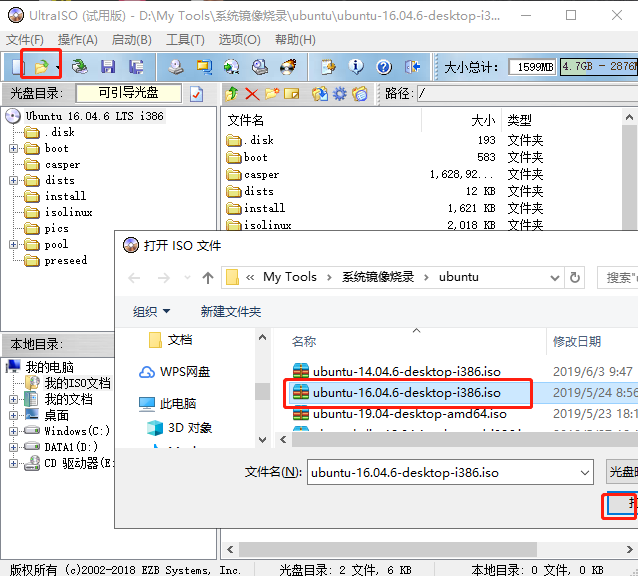

2. 将优盘插入，选择“菜单栏——启动——写入硬盘映像”后，在弹出的对话框观察到硬盘启动器已默认选择该U盘，选择“便捷启动下”的“写入新的驱动器引导扇区”——“Syslinux”，最终点击“写入”按钮即可：

   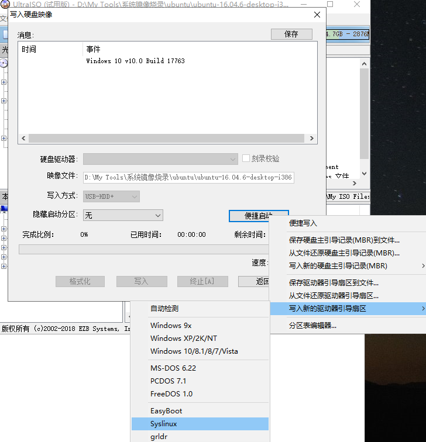

3. 将该盘插入工控机并开机，在开机界面根据自己不同工控机地实际设置，进入boot启动盘选项，并选择该U盘，系统将会进入Ubuntu安装地引导界面，根据引导进行设置后，安装完成。具体设置就不再多诉。


## Python环境下的配置： 

**无论是windows环境还是Ubuntu环境，我都选择利用python环境下的相关组件作为传感系统，串口、数据协议解析和发送的依赖工具，这在提供稳定环境地同时，也让系统的调试、维护变得更加简便。所以，python的环境是基础。**

通过“python --version”命令，可以观察到系统自带2.7和3.5版本，不过为了更好的使用，我选择了安装额外的3.7最新版python。而在安装的同时，考虑到后续系统配置文件的路径问题，最好采用第三方PPA存储库的方式进行安装，安装过程也很简单：

1. 首先，安装Ubuntu软件属性包（如果它尚未安装在您的系统上）：

```
sudo apt update
sudo apt install software-properties-common
```

2. 运行命令，以添加PPA ：

```
sudo add-apt-repository ppa:deadsnakes/ppa
```

3. 运行以下命令进行Python 3.7的安装：

```
sudo apt update
sudo apt安装python3.7
```

**安装完成后，再次通过“python --version”进行python版本的检查，但发现系统默认的运行环境依然是python2.7，所以需要对其优先级进行设置：**

4. 我们将使用 update-alternatives 来为整个系统更改 Python 版本。以 root 身份罗列出所有可用的 python 替代版本信息，但会发现报错：

```shell
root:~$ update-alternatives --list python
    update-alternatives: error: no alternatives for python
```

5. 如果出现以上所示的错误信息，则表示 Python 的替代版本尚未被 update-alternatives 命令识别。我们需要更新一下替代列表，将 python2.7 、3.5以及3.7版本加入其中，并通过最后一个参数进行优先级设置（数值越高，优先级越高）：

```shell
root:~$ sudo update-alternatives --install /usr/bin/python python /usr/bin/python2.7 1

root:~$ sudo update-alternatives --install /usr/bin/python python /usr/bin/python3.5 2

root:~$ sudo update-alternatives --install /usr/bin/python python /usr/bin/python3.7 3
```


6. 我们为 /usr/bin/python3.7 设置的优先级为3，所以update-alternatives 命令会自动将它设置为默认 Python 版本，再次输入命令就会发现变化：

```
root:~$ python --version
```

7. 当我们需要再次对优先级进行变更时，便可通过以下命令进行可替代版本的显示与切换

```shell
root:~$ sudo -alternatives --list python
root:~$ update-alternatives --config python
```

**注意：在安装时，若出现“无法定位软件包”的问题时，则需要进行软件源更新：**

```
 sudo apt-get update
 sudo apt-get upgrade
```

如果依旧无法解决问题，则需要打开源并进行更换了，具体更换方法也很简单，请自行查找：

```
sudo vim /etc/apt/sources.list
```


## 工具的安装：

**python平台下的工具包，无论是安装还是应用，都非常便捷，但也不可或缺。所以首先需要进行pip包管理器的安装：**

1. 输入指令：

   ```
   sudo apt-get install python3-pip
   ```

2. 通过指令查看是否安装：

   ```
   pip --version
   ```

3. 接下来分别进行工具包的安装：

   ```
   # 串口解析工具
   sudo pip install pyserial
   # 协议解析工具
   sudo pip install modbus_tk
   # Mqtt协议工具
   sudo pip install paho-mqtt
   ```


## **串口的配置与调试：**
**当环境基本搭建完毕，便可进行串口的调试阶段了，与windows类似的，ubuntu系统也有独特的串口管理终端以及串口调试终端，虽不是那么复杂，但是使用上却更加便捷。这也为系统的调试变得更方便：**

1. #### **串口检测与终端设置：**

   1）查看串口的插拔状况记录：

   

   2）列出USB相关信息：

   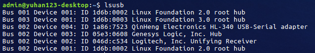

   3）安装串口终端软件：

   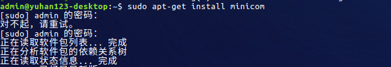

   4）打开终端配置菜单：

   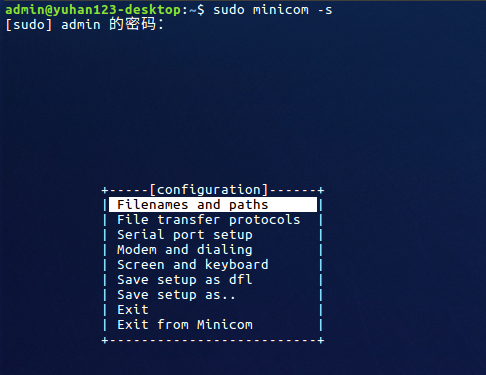

   5）选择Serial port setup后更改串口及波特率：

   ​	- 选择：对应字母

   ​	- 确定选择：回车

   ​	- 保存：上下选择

   ​	- 退出终端：ctrl+a后按x键

   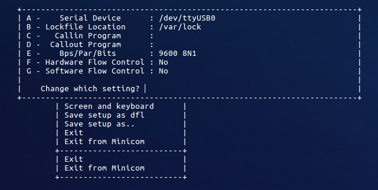

 2. #### **串口驱动配置：（可跳过）**

      **查看串口驱动运行状况，发现当前系统自带驱动CH341，所以无需额外的更新驱动了，可直接进入下一步进行串口调试配置。**

      

      **若驱动版本过旧，或无法检测驱动存在时，则需要继续进行以下步骤：**

      1）查找最新的驱动，[并下载安装包](https://blog.csdn.net/jazzsoldier/article/details/70169732):

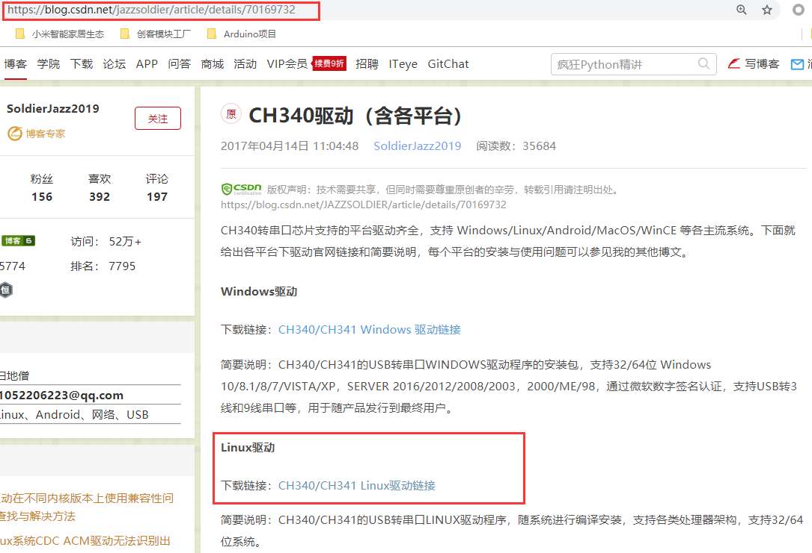

 	2）进入老版本驱动目录进行旧版本驱动的删除：

 

​	3）解压新驱动并进行make编译安装，过程中发现了报错：


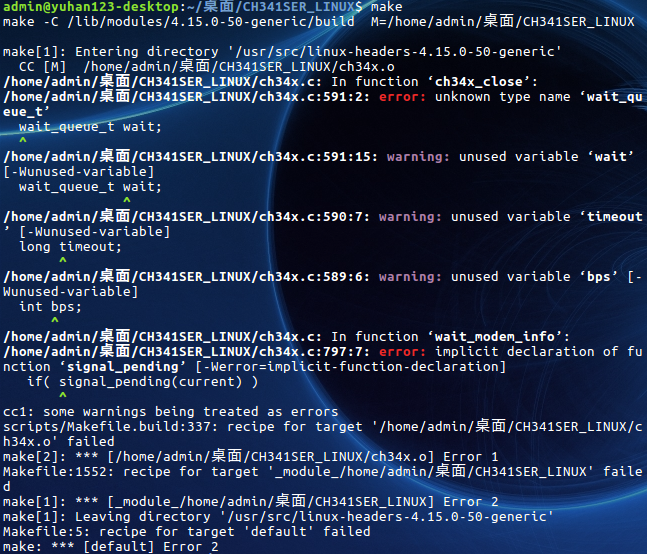

​	4）将报错所指的内容进行注释，并添加新的头文件进行解决：


​	5）重新make编译安装，不再报错，便可直接进行make load：

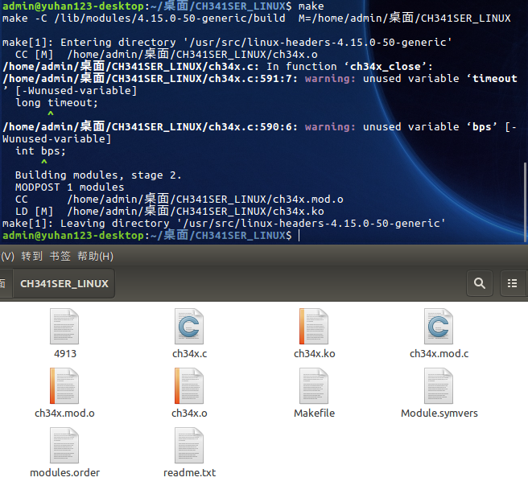


​	6）将编译后产生的新驱动文件，拷贝至原驱动文件所在路径下即可：


​	7）由于额外更新的驱动，无法随其他系统驱动进行开机自启，所以需要在rc.local中添加驱动自启配置：

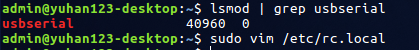

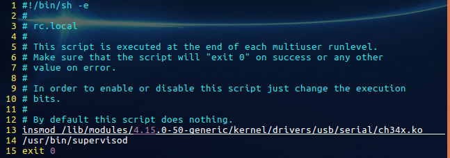

3. #### 串口调试：

   1）进行串口调试工具“cutecom”的安装：

   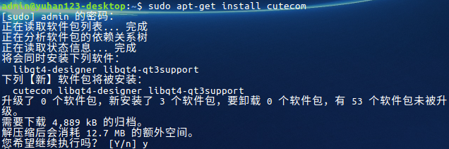

   2）安装完成后，再次查看串口的插拔记录，以确定当前串口设备串口位置：

   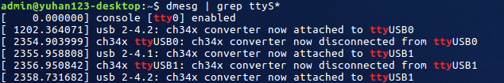

   3）在搜索框搜索串口工具后打开，输入串口设置并打开串口设备，当出现如下所示“无法打开串口“时，则重新更改串口权限：

   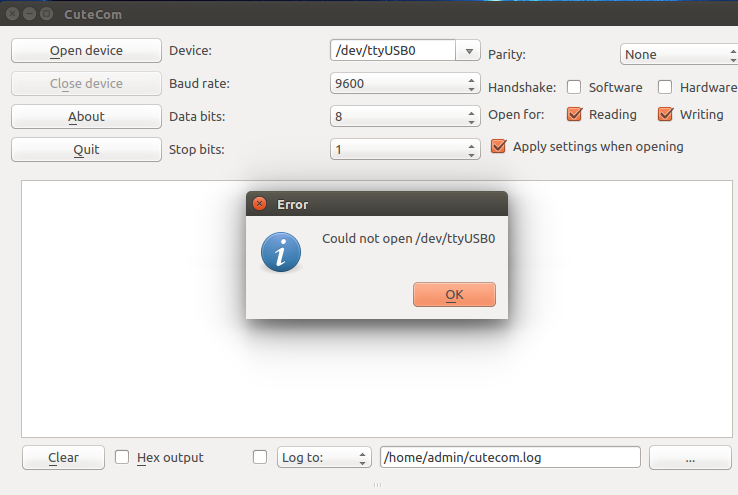

   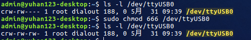

   4）当配置权限完成，便可输入传感器的modbus协议10进制请求指令，发现返回10进制的数据，调试完成：

   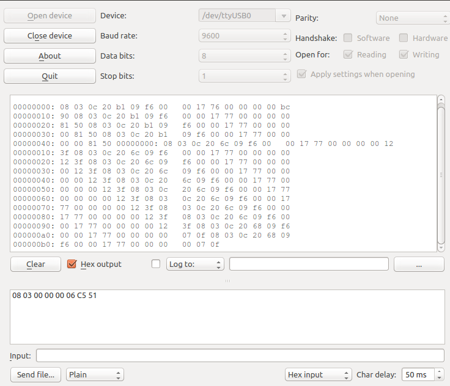

   5）而串口的权限同样需要进行开机自动配置，通过udev文件便可实现串口权限的永久性配置，以避免在每次自启后权限开放的手动设置：

   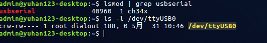

   

   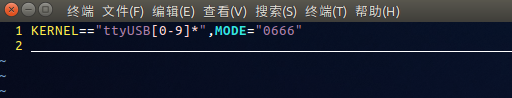

   6）重启后，串口驱动、权限全部重启完成，且能正常通过调试：

   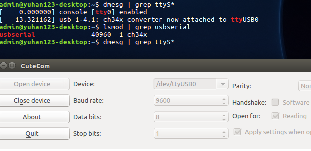


## 开机自启设置：

**最后，需要进行桌面上python脚本的开机自启设置，与windows相比就不那么方便了，但依旧可以借助supervisor进程管理器进行设置：**

1. 安装进程管理器：

```
sudo apt-get install supervisor
```

2. 在/etc路径下创建目录/supervisor，并在该目录中用命令生成配置文件：（此步骤可省去）

```
echo_supervisord_conf > /etc/supervisord.conf
```

3. 在该目录下继续创建/conf.d目录，并在该目录中创建个人配置文件test.conf: 

   *注意：command命令文件路径，最好保存在root权限的路径下，而usr也最好是root*   

```
[program:CPU_GPU_monitor]
autorestart=True
autostart=True
command=python3 /home/admin/桌面/send.py          
user=admin
```

4. 执行supervisor命令，尝试更新配置，发现了报错;


5. 对当前报错中所涉及的问题，进行相关module的状态查看以进行解决，发现模块已安装：


6. 但supervisord不支持python3，所以通过vim对"supervisord"以及"supervisorctl"的python版本环境进行更改，别解决了前面的报错问题：


7. 当我再次进行更新检测时，再次出现了其他报错：


8. 这时候需要对路径文件进行检测，果然发现conf.d外的重复文件”test.conf“与该文件夹内的同名文件冲突，素所以需要重新拷贝，并移除"conf.d"外的test文件：


9. 与此同时，检测etc/路径下是否存在supervisord.conf配置文件，将其删除后，便可更新启动程序：


9. 当一切启动正常后，开始进行自启文件的配置，只需在exit0前添加指令即可：


​	或者添加路径为：

```
supervisord -c /etc/supervisor/supervisord.conf
```


10. 对该自启脚本权限进行设置：


11. 重启后，查看进程是否被执行，验证完毕后，Ubuntu工控机下的物联网系统便完成搭建了：


## 远程控制：

**目前，暂时采用Teamviwer进行无人值守远程设置：**

1. 下载teamviewer：

   ```
   # 36位工控机
   wget http://download.teamviewer.com/download/teamviewer_i386.deb
   # 树莓派
   wget http://download.teamviewer.com/download/linux/version_11x/teamviewer-host_armhf.deb
   ```

2. 安装依赖包：

   ```
   sudo apt-get install libdbus-1-3:i386 libasound2:i386 libexpat1:i386 libfontconfig1:i386 libfreetype6:i386 libjpeg62:i386 libpng12-0:i386 libsm6:i386 libxdamage1:i386 libxext6:i386 libxfixes3:i386 libxinerama1:i386 libxrandr2:i386 libxrender1:i386 libxtst6:i386 zlib1g:i386 libc6:i386
   ```


3. 执行安装：

   ```
   # 工控机
   sudo dpkg -i teamviewer_i386.deb
   # 树莓派
   sudo dpkg -i teamviewer-host_armhf.deb
   ```

   如果安装失败，执行以下命令修复依赖包：

   ```
   sudo apt-get install -f
   ```

4. 命令启动teamviewer，或在搜索框检索程序并打开。启动后进行账号登陆、无人值守与开机启动设置：

   ```
   sudo teamviewer --daemon start
   ```


